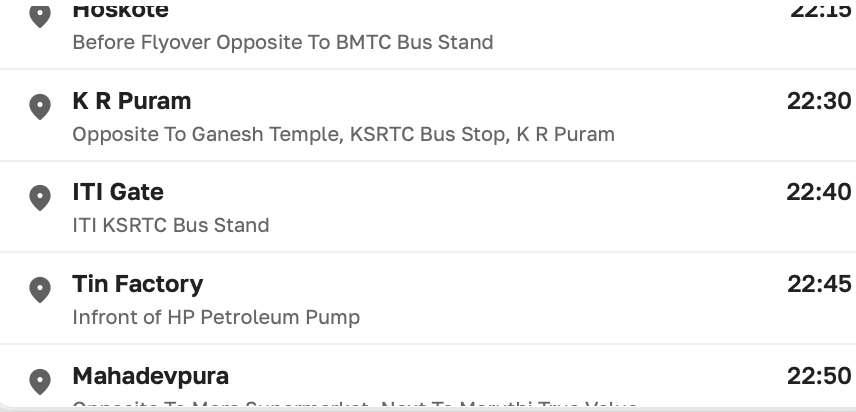
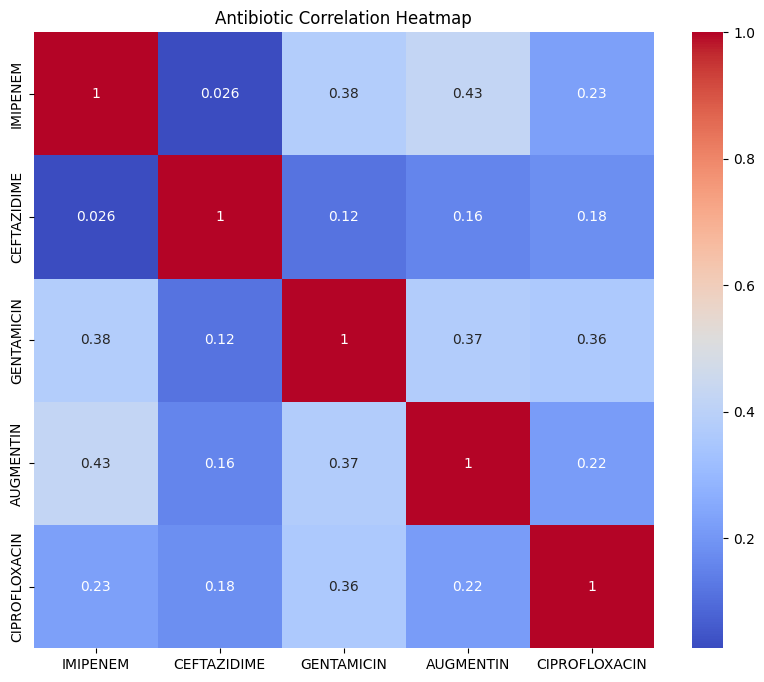
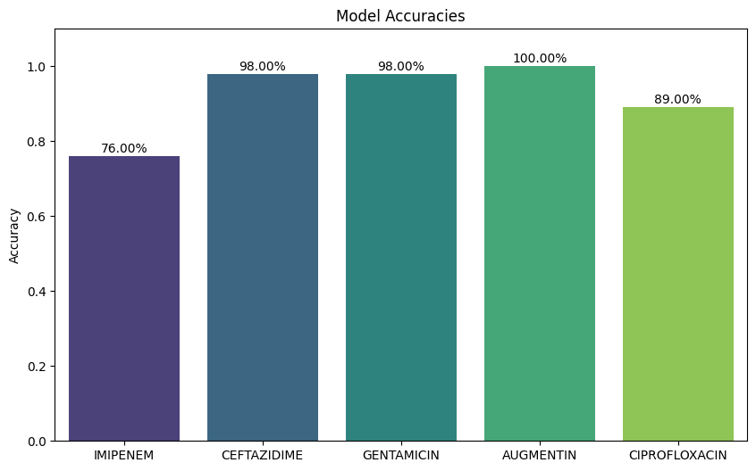

# Antibiotic Resistance Prediction System 🧬

A clinical decision support tool developed with Machine Learning to predict antibiotic resistance based on clinical measurements and geographical location.

## 📌 Project Overview
Antimicrobial resistance is a critical global health challenge. This project leverages an ensemble of AI models (XGBoost & Random Forest) to provide data-driven predictions on whether a patient's sample will be Sensitive or Resistant to specific antibiotics.

### 🏠 App Interface


---

## 📊 Dataset Information
The project utilizes the **Antimicrobial Resistance Dataset** for training and validation.
- **Source:** [Mendeley Data - Antimicrobial Resistance Dataset](https://data.mendeley.com/datasets/ccmrx8n7mk/1)
- **Primary Features:** Clinical location and Zone of Inhibition (ZOI) measurements for:
  - IMIPENEM
  - CEFTAZIDIME
  - GENTAMICIN
  - AUGMENTIN
  - CIPROFLOXACIN

---

## 🛠 Feature Engineering & Methodology
Following the principles of **Feature Engineering and Selection** by Max Kuhn, the project implements:

1.  **Categorical Encoding:** One-hot encoding for `Location` to capture site-specific resistance trends while avoiding ordinal bias.
2.  **Missing Value Strategy:** Implementation of a "Safe-Default" system for missing observations (per the requirement to handle unseen measurements).
3.  **Target Binarization:** Continuous ZOI measurements were transformed into binary labels (0 = Resistant, 1 = Sensitive) using clinically relevant thresholds:
    - IMIPENEM: 28mm
    - CEFTAZIDIME: 28mm
    - GENTAMICIN: 24mm
    - AUGMENTIN: 28mm
    - CIPROFLOXACIN: 26mm
4.  **Ensemble Modeling:** Utilization of XGBoost and Random Forest classifiers to handle non-linear relationships and feature interactions.

### 🔍 Analysis Visualizations

*Figure 1: Correlation analysis between different antibiotic effectiveness levels.*


*Figure 2: Performance metrics of the trained models across different target antibiotics.*

---

## 🚀 How to Run the App
The application is built using **Streamlit**. 

### 1. Prerequisites
Ensure you have Python 3.9+ installed.

### 2. Setup Environment
```bash
# Create and activate virtual environment
python3 -m venv venv
source venv/bin/activate

# Install dependencies
pip install streamlit pandas joblib xgboost scikit-learn matplotlib seaborn openpyxl
```

### 3. Launch App
```bash
streamlit run app.py
```

---

## 💡 System Capabilities
- **Prediction for 5 Antibiotics:** Even with partial data, the system predicts resistance for all five drugs.
- **Smart Recommendation:** Suggests the "Best Drug" based on both sensitivity prediction and model confidence.
- **Real-time Monitoring:** Interactive bar chart for comparing sensitivity probabilities.

---
*Created as part of a Healthcare AI initiative.*
